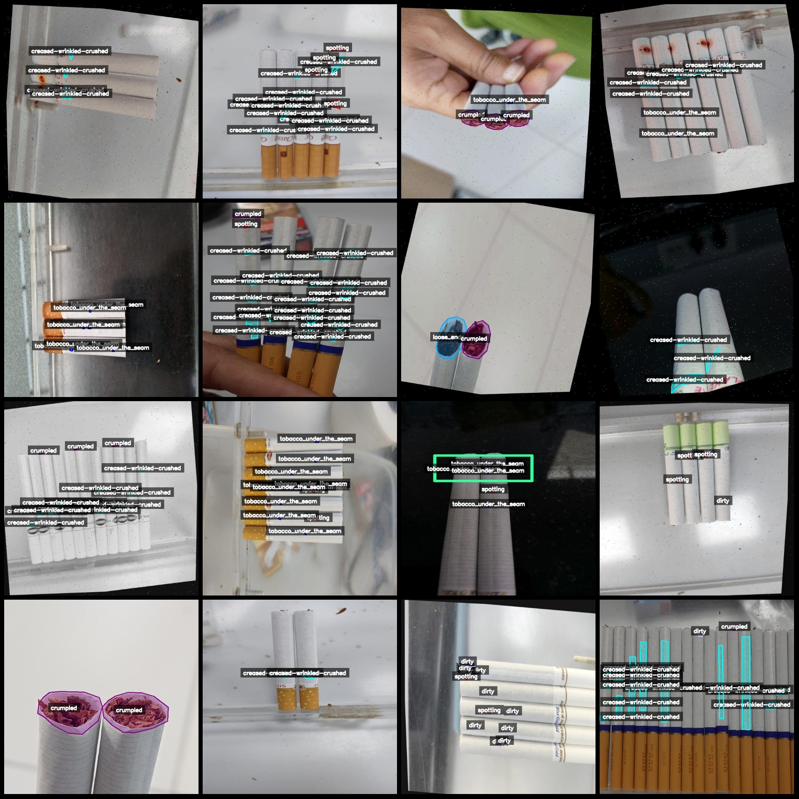
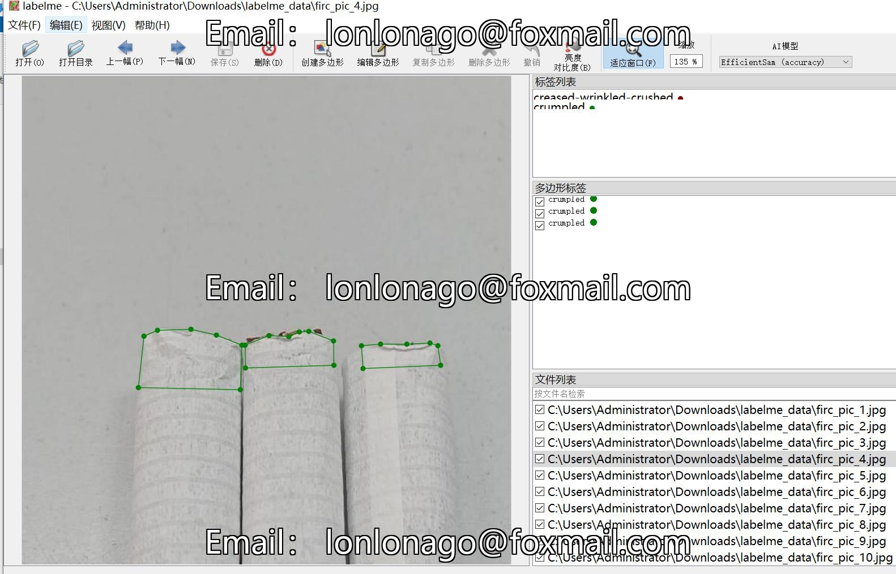

# Smoking Detection and Segmentation Data Set with 825 Images in LabelMe Format, 9 Classes with Enhanced Features

In the dataset, there are a large number of augmentations. Approximately 300 images are original images, and the rest are rotation-enhanced images.
Dataset format: labelme format (does not contain maskfile, only contains jpgimage and corresponding jsonfile)
number of images: 825  
annotation count: 825  
annotationnumber of classes: 9  
annotation class names:["creased-wrinkled-crushed","crumpled","dirty","flattened","loose_ends","puctured-torn","recessed_ends","spotting","tobacco_under_the_seam"]  
boxes per class:   
Creased-wrinkled-crushed: 2779
Crumpled: 1168
Dirty: 338
Flattened: 145
Loose ends: 120
Puckered-torn: 46
Recessed ends: 10
Spotting: 413
Tobacco under the seam: 733
total boxes: 5752  
Use the labelme=5.5.0 tool.
image resolution: 640x640  
Annotation Rules: Draw polygons around classes in the image.
Important Notes: You can open and edit the dataset using labelme, and the JSON dataset needs to be converted into mask, Yolo format, or COCO format for semantic segmentation or instance segmentation.
Special Statement: This dataset does not guarantee the accuracy of the trained models or weight files.
Image Preview:
Annotation Example:
Original Image (16 randomly selected images):
Annotation Drawing Results:
Labelme Edited Image Example:
## Images

Here is a pay link on Stripe ( https://buy.stripe.com/3cs8yP7sY87d0vu9AB ). Please contact me lonlonago@foxmail.com after funding $89, and I will send you a complete data files , thank you!

